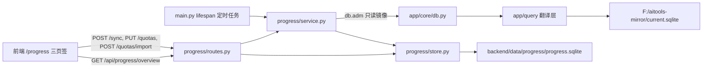

## Product Overview

在 `AI工具合集`（FastAPI + Vue3 单入口 8080 工程）中新增独立模块「抽采样进度统计」，访问路径 `/progress`，页面内含「数据看板 / 任务量录入 / 产品类型配置」三个页签，并在导航首页新增一张工具卡片。完成量按年从本地 SQLite 镜像聚合（区域 × 产品类型），任务量手工录入或 Excel 导入，两者结合实时算出完成率，支撑"任务进度自动统计"。

## Core Features

- **产品类型配置（动态表头来源）**：产品类型为后台可配置变量，支持新增、编辑、删除/停用、排序，字段含 产品类型名称、别名、所属品类、排序、状态；前端所有表格列按配置动态生成，禁用/删除后不再出现在表头（不破坏历史数据）。
- **完成量抓取**：按年聚合现有 SQLite 镜像（`F:/aitools-mirror/current.sqlite`，数据随每天 19:00 镜像同步更新）——区域取受检单位所在地解析出的区县，产品类型取样品名称，完成量 = 去重样品数；支持手动同步与每天定时同步，每次抓取写入同步日志（来源、数据截止时间、抓取行数、耗时、状态）。
- **任务量录入**：按「年份 × 区域 × 产品类型」批量录入，表格化输入（区域为行、产品类型为列），支持 Excel 导入（含模板）、整批保存、导出与清空；导入失败逐行给出原因且不覆盖已有数据。
- **统计展示**：总览卡片（总任务量、完成量、完成率、已录入任务量的区域数/产品类型数）；区域 × 产品类型动态明细表，含合计行/合计列、完成率色阶、超 100% 与未达标提示；ECharts 图表：区域完成率对比条形图、品类分布环形图；页面顶部固定透出数据来源与数据截止时间，并对"未匹配到产品类型的样品数""未归类的区域"单独提示，避免静默丢数。
- **视觉表现**：沿用现有看板的深色科技渐变 + 玻璃拟态卡片风格（Tailwind + 自定义 `glass-card/panel-title/tech-btn/year-select/status-pill` 类），渐变标题、卡片入场微动效、图表与表格超限标色，桌面端宽屏（max-width 1440）布局，与既有 5 个模块视觉一致。

## Tech Stack Selection

- 后端：沿用 `FastAPI` + `pydantic-settings`（conda 环境 `aitools`，端口 8080）；不引入新框架、不引入新数据库驱动。
- 数据：达梦数据经**现有 SQLite 镜像**读取（`app/core/db.py::adm` → `app/query/try_mirror`，镜像模式严格不回退直连）；配置/任务量/完成量快照/同步日志用**标准库 `sqlite3`** 落 `backend/data/progress/progress.sqlite`。
- 前端：沿用 `Vue 3 + TypeScript + Vite + Tailwind`，图表复用既有 ECharts 封装（`components/charts/useECharts.ts`、`BarChart.vue`），Excel 复用已有依赖 `exceljs`。
- 文档：按 S1–S6 工作流产出 `AI构建工作流/input/抽采样进度统计.md` 与 `AI构建工作流/output/抽采样进度统计/01~06`（技能位于 `AI构建工作流/.codebuddy/skills`，本工作区不复制技能）。

## Implementation Approach

核心策略：**新增一个模块、复用四套既有范式**（模块分层范式、SQLite 存储范式、镜像取数范式、图表/API 客户端范式），零改动既有模块。

1. **取数（完成量）**：一次 SQL 从镜像取当年轻量明细（`s.ID / s.NAME / d.DETECTED_COMPANY_ADDRESS / d.SAMPLING_DATE / d.ACCEPT_TIME`，走 `DT_DETECTION` JOIN `DT_SAMPLE`，条件含 `IS_DELETED = 0`），在 Python 侧完成三件事：

- **区域归类**：优先复用 `app/modules/board/service.py::_parse_region`（与看板区县口径同源，便于与看板对拍），未命中的兜底用前端 `parseCityCounty` 的 Python 等价实现；仍无法归类 → 计入「未归类」并在页面提示（保证 完成量合计 = 当年样品数，不静默丢数）。
- **产品类型匹配**：名称/别名做全角半角+去空白归一后匹配配置，未匹配 → 计入「未匹配样品数」提示。
- **聚合**：`COUNT(DISTINCT s.ID)` 按 (区域, 产品类型) 汇总，写入 `done_snapshot`。

2. **年份归属**：以 `d.SAMPLING_DATE` 为归属年份，为空时回退 `d.ACCEPT_TIME`；为避免函数包裹导致全表扫描，SQL 用「日期区间 + `IS NULL` 补集」两段（可加 `UNION ALL`），不做 `EXTRACT/YEAR()` 等无法走索引的写法。
3. **时序（手动/定时同步）**：`POST /api/progress/sync` 手动重算；`main.py` 的 `lifespan` 内注册定时任务（`PROGRESS_SYNC_AT`，默认 `19:40`，晚于镜像 19:00；留空关闭）——与现有镜像定时同步写法同构。每次同步写 `sync_log` 并记 `data_deadline`（取自镜像 `sync_meta` 的 `finished_at`）。
4. **读取路径极短**：页面首屏只打 **1 个聚合接口** `GET /api/progress/overview?year=`（一次返回 summary + 矩阵 + 图表数据 + meta），数据全部来自本地 `progress.sqlite`（毫秒级），避免多次往返与 N+1 组装。
5. **写路径受控**：配置与任务量写入均按 `UNIQUE` 约束 + 事务 + 整批校验；被任务量引用的产品类型不允许物理删除（自动降级为停用），保证历史可解释。
6. **Excel 导入**：沿用「前端 `exceljs` 解析 → 后端整批校验写入」范式（与 `personnel` 能力表上传一致），后端返回 `{ok, saved, failed:[{row, reason}]}`；同一事务写入，失败不落库。

**性能与可靠性**：单年镜像聚合在万级样品量下为百毫秒级（一次扫描 + 内存汇总），结果落表后看板恒为毫秒级；同步失败不影响页面（保留上次快照并在同步日志与页面标出错误）；镜像缺失/翻译失败时接口明确报错（`DbError` → 502 + detail），绝不静默降级。

**避免技术债**：不新增镜像表（`DT_DETECTION`/`DT_SAMPLE` 已在 `app/mirror/sync.py::DM_TABLES` 内）；区域清单复用 `board/service.REGIONS`；图表复用现有 ECharts 组件（仅新增一个环形图组件）；错误处理、日志、配置写法全部照抄既有模块。

## Implementation Notes

- **SQL 方言约束**（`app/query/__init__.py`）：可用 `NVL`（自动转 `IFNULL`）、`TO_CHAR` 受限格式、日期区间；**禁用** `CONNECT BY` / `DECODE` / `ROWNUM` / `LISTAGG` / `MERGE` / `SELECT TOP`，否则镜像直接报错。
- **不新增达梦连接**：用户已确认走镜像；模块内不得调用 `dm_execute` 直连路径（镜像模式下会被架构约定拒绝）。
- **索引（可选）**：若实测单年聚合偏慢，可在 `app/mirror/schema.py::INDEX_SPECS` 为 `DT_DETECTION` 追加 `("SAMPLING_DATE",)`（仅下次镜像同步生效，不影响正确性）。
- **数据新鲜度必须可见**：完成量快照的 `synced_at` 与镜像 `data_deadline` 都要在页面顶部与同步结果中透出，禁止让使用者误以为实时。
- **配置项**：`backend/.env` 新增 `PROGRESS_DIR`（留空 → `backend/data/progress`）与 `PROGRESS_SYNC_AT`，默认值写在 `app/core/config.py`，与 `cma_ledger_dir` / `personnel_ability_dir` 写法一致。
- **前端改动生效**：改前端后必须 `npm run build`（`frontend/dist` 由后端同源托管）；`一键启动.bat` 亦会自动构建。
- **影响面控制**：只新增路由与导航卡片，不改动 `/dm` `/sqlserver` `/board` `/personnel` `/cma` 的任何逻辑与样式；`/api/app-info` 的 `modules` 字典同步补 `progress`。
- **日志**：模块内使用 `logging.getLogger("app.progress.*")`，只记条数/耗时/错误摘要，不打印样品明细，不记任何口令。
- **中文路径**：写 `AI构建工作流` 目录（工作区之外）时，脚本内直接写路径，不用命令行传中文参数。

## Architecture Design

数据流（新增模块用实线，指向既有组件）：



- **分层**：`routes.py`（HTTP 契约、参数校验、错误映射）→ `service.py`（镜像聚合、区域/产品类型归类、矩阵与图表组装）→ `store.py`（SQLite 结构、事务、唯一约束）。
- **与既有架构的关系**：完全对齐 `board`（service 聚合）+ `personnel`（store 落 SQLite + 上传整批替换）两套现有范式，不引入新架构模式。
- **关键契约**：`store.py` 是唯一写 SQLite 的地方；`service.py` 是唯一读镜像的地方；`routes.py` 不直接碰数据源（便于 S3 用临时目录 + 假引擎做单测）。

## Directory Structure

```
AI工具合集/
├── backend/
│   ├── .env                                          # [MODIFY] 新增 PROGRESS_DIR / PROGRESS_SYNC_AT
│   ├── app/
│   │   ├── main.py                                   # [MODIFY] import/include progress_router；/api/app-info.modules 加 progress；lifespan 内注册完成量定时同步任务（PROGRESS_SYNC_AT，留空关闭）
│   │   ├── core/config.py                            # [MODIFY] 新增 progress_dir（留空→backend/data/progress）、progress_sync_at（默认 "19:40"）
│   │   ├── mirror/schema.py                          # [MODIFY-可选] INDEX_SPECS 为 DT_DETECTION 追加 ("SAMPLING_DATE",)，仅在实测聚合偏慢时启用
│   │   └── modules/progress/
│   │       ├── __init__.py                           # [NEW] 包声明（照 board/personnel 范式）
│   │       ├── store.py                              # [NEW] SQLite 存储层：标准库 sqlite3 + 目录由 config 决定；建表 product_type / task_quota / done_snapshot / sync_log / app_meta；提供产品类型 CRUD（含软停用与"被引用不可删"校验）、任务量批量 upsert（UNIQUE(year,region,product_type_id)，事务内成败一致）、完成量快照整年替换（DELETE+批量 INSERT 同事务，失败回滚保留旧快照）、同步日志读写、last_sync 元信息
│   │       ├── service.py                            # [NEW] 业务层：镜像聚合 SQL（DT_DETECTION JOIN DT_SAMPLE，IS_DELETED=0，年份用 SAMPLING_DATE 区间 + IS NULL 时 ACCEPT_TIME 区间，避免 EXTRACT/YEAR 包裹）；Python 侧区域归类（复用 board/service._parse_region + parseCityCounty 等价实现兜底 → 「未归类」）、产品类型名称/别名归一匹配（未匹配计数）、矩阵与图表数据组装、总览指标计算（完成率=完成量/任务量，任务量为 0 显示「—」且不参与总完成率分母）
│   │       └── routes.py                             # [NEW] 接口：GET /api/progress/overview?year=；POST /api/progress/sync；GET /api/progress/sync-log；GET/POST/PUT/DELETE /api/progress/product-types；GET /api/progress/quotas?year=；PUT /api/progress/quotas；POST /api/progress/quotas/import（批量校验 + 事务写入，返回 saved/failed 明细）。错误统一映射 HTTP 502 + {detail}，与 board 一致
│   └── tests/
│       ├── test_progress_service.py                  # [NEW] 单测：区域归类（含未归类）、产品类型别名匹配、矩阵/完成率组装（任务量为 0 的分母处理）、年份区间 SQL 拼接
│       └── test_progress_store.py                    # [NEW] 单测：临时目录下建表幂等、任务量 upsert 唯一性、快照整年替换失败回滚保留旧数据、产品类型被引用不可删、同步日志写入
├── frontend/
│   ├── src/
│   │   ├── api/client.ts                             # [MODIFY] 新增 progressApi（overview/sync/syncLog/productTypes/quota/import），沿用现有 get/post/put/del 封装与错误文案
│   │   ├── router/index.ts                           # [MODIFY] 新增 { path: '/progress', name: 'progress', component: ProgressView }
│   │   ├── views/NavView.vue                         # [MODIFY] TOOLS 增加「抽采样进度统计」卡片（path /progress）+ 配色类 .c-progress
│   │   ├── views/ProgressView.vue                    # [NEW] 模块外壳：渐变标题 + 年份选择 + 页签（数据看板/任务量录入/产品类型配置）+ 数据来源与截止时间状态条 + 页签内容
│   │   ├── views/progress/DashboardPanel.vue         # [NEW] 总览卡片（总任务量/完成量/完成率/覆盖区域数）+ 区域完成率条形图 + 品类分布环形图 + 动态矩阵表格（首列 sticky、合计行列、完成率色阶、超 100% 与未达标标色）+ 未匹配/未归类提示 + 导出按钮 + 同步完成量按钮
│   │   ├── views/progress/QuotaPanel.vue             # [NEW] 任务量批量录入：区域为行 × 产品类型为列的输入表格（支持粘贴与批量填充）、按区域/产品类型批量赋值、Excel 导入（拖拽/选择 + 模板下载 + 导入结果逐行回显）、保存/清空/导出
│   │   ├── views/progress/ProductTypePanel.vue       # [NEW] 产品类型配置：列表表格（名称/别名/所属品类/排序/状态）+ 新增编辑弹层 + 上下移排序 + 启用停用 + 删除（被引用时提示改为停用）
│   │   ├── views/progress/excel.ts                   # [NEW] Excel 导入解析与导出（exceljs）：模板列「区域 | 产品类型 | 任务量」，解析为行数组交后端校验；看板/录入视图导出
│   │   └── components/charts/PieChart.vue            # [NEW] 环形/饼图组件：复用 useECharts 封装（与 BarChart 同风格、同配色数组）
│   └── dist/                                         # 由 npm run build 重新生成（后端同源托管）
├── 使用说明.txt                                       # [MODIFY] 补充 /progress 页面入口与口径说明
└── AI构建工作流/                                       # 工作区之外，按 S1–S6 契约产出文档
    ├── input/抽采样进度统计.md                          # [NEW] 需求原文（用户原话 + 澄清结论）
    └── output/抽采样进度统计/
        ├── 01_问题定义.md ~ 06_解决报告.md              # [NEW] S1~S6 产物（含验收标准 AC、工作列表 W、测试与验证结论）
        └── _process/                                  # [NEW] 过程文件（口径探测脚本输出、截图、对拍数据）
```

## Key Code Structures

`progress.sqlite` 表结构（多模块依赖，需精确）：产品类型为动态表头唯一来源，任务量与完成量以 `product_type_id` 关联，改配置不改历史数据。

```sql
-- 产品类型配置（动态表头来源）
CREATE TABLE IF NOT EXISTS product_type (
  id         INTEGER PRIMARY KEY AUTOINCREMENT,
  name       TEXT    NOT NULL,              -- 表头列名（如 豇豆）
  alias      TEXT    NOT NULL DEFAULT '',   -- 别名，用 | 分隔，用于匹配样品名称
  category   TEXT    NOT NULL DEFAULT '',   -- 所属品类（蔬菜/水果/畜产品/水产品/其他），供品类分布图
  sort_no    INTEGER NOT NULL DEFAULT 0,    -- 列顺序
  enabled    INTEGER NOT NULL DEFAULT 1,    -- 1 启用 / 0 停用（停用列不出现在表头）
  updated_at TEXT    NOT NULL DEFAULT ''
);
CREATE UNIQUE INDEX IF NOT EXISTS ux_product_type_name ON product_type(name);

-- 任务量（手工录入 / Excel 导入；按年）
CREATE TABLE IF NOT EXISTS task_quota (
  year            INTEGER NOT NULL,
  region          TEXT    NOT NULL,         -- 区县，与 board/service.REGIONS 同源
  product_type_id INTEGER NOT NULL,
  quota           INTEGER NOT NULL DEFAULT 0,
  updated_at      TEXT    NOT NULL DEFAULT '',
  PRIMARY KEY (year, region, product_type_id)
);

-- 完成量快照（按年；一次同步整年替换，失败回滚保留旧快照）
CREATE TABLE IF NOT EXISTS done_snapshot (
  year            INTEGER NOT NULL,
  region          TEXT    NOT NULL,
  product_type_id INTEGER NOT NULL,
  done            INTEGER NOT NULL DEFAULT 0,
  synced_at       TEXT    NOT NULL DEFAULT '',
  PRIMARY KEY (year, region, product_type_id)
);

-- 完成量同步日志（每次抓取一行，只增不删）
CREATE TABLE IF NOT EXISTS sync_log (
  id          INTEGER PRIMARY KEY AUTOINCREMENT,
  year        INTEGER NOT NULL,
  started_at  TEXT NOT NULL DEFAULT '',
  finished_at TEXT NOT NULL DEFAULT '',
  source      TEXT NOT NULL DEFAULT '',     -- 固定 'mirror'
  data_deadline TEXT NOT NULL DEFAULT '',   -- 镜像快照数据截止时间
  rows        INTEGER NOT NULL DEFAULT 0,   -- 抓取明细行数
  done_total  INTEGER NOT NULL DEFAULT 0,   -- 去重样品总数
  unmatched   INTEGER NOT NULL DEFAULT 0,   -- 未匹配产品类型样品数
  unclassified INTEGER NOT NULL DEFAULT 0,  -- 未归类区域样品数
  elapsed_ms  INTEGER NOT NULL DEFAULT 0,
  status      TEXT NOT NULL DEFAULT '',     -- ok / failed
  error       TEXT NOT NULL DEFAULT ''
);
```

## 设计风格

沿用并强化现有工程（`styles/index.css`、`tailwind.config.js`、`BoardView.vue`）的**深色科技渐变 + 玻璃拟态**语言：靛蓝→紫→蓝的固定径向渐变背景（紫/青/粉三处柔光），半透明玻璃卡片（`rounded-2xl border-white/15 bg-white/10 backdrop-blur-xl`），渐变文字标题（`#60A5FA → #A78BFA → #F472B6`），青蓝渐变主按钮，卡片轻微上浮与阴影；页面入场使用既有 `animate-fade-in-up`，加载使用既有 `.loader`。整页为桌面端宽屏布局（`max-w-[1440px]`），高信息密度但不拥挤。

## 目录与导航

桌面 Web 模块：顶部为「渐变标题 + 年份选择 + 数据来源/截止时间状态胶囊 + 同步完成量按钮」，其下为模块内页签（数据看板 / 任务量录入 / 产品类型配置），页脚为口径说明条（替代移动端底部导航栏）。路由 `/progress`，导航首页新增同风格卡片。

## 页面规划（3 页）

### 1. 数据看板页（默认页签）

- **顶部操作区**：标题、年份下拉（`year-select`）、数据来源与镜像数据截止时间胶囊、`⟳ 同步完成量` 主按钮（同步中禁用并显示进度文案）、导出 Excel 次级按钮。
- **总览卡片区**：四张玻璃卡（总任务量 / 完成量 / 总完成率 / 覆盖区域数），完成率用大号渐变数字 + 进度细条，低于阈值时条变暖色，支持 hover 上浮。
- **图表区（两栏自适应）**：左「区域完成率对比」横向条形图（按完成率降序、超 100% 变色），右「品类分布」环形图（按所属品类汇总任务量与完成量，中心显示合计）。
- **动态明细矩阵**：行=区域（`board/service.REGIONS` 固定顺序 + 必要时额外「未归类」行），列=启用中的产品类型（按 `sort_no`），单元格显示 完成量/任务量 与完成率百分比并按色阶着色；首列与表头 sticky，横向滚动；底部合计行与右侧合计列；表格为空时显示 `empty-tip` 引导去录入任务量。
- **提示条**：未匹配产品类型样品数、未归类区域样品数、上次同步时间/失败原因（有则高亮，无则不渲染）。

### 2. 任务量录入页

- **顶部说明区**：年份选择、当前产品类型列与区域行的口径说明、`下载模板` 与 `导入 Excel` 入口。
- **批量录入表格**：区域为行、启用产品类型为列的可编辑输入格（数字校验、支持粘贴与批量填充、行/列一键填值、清空该行/列），脏数据以角标提示未保存数量。
- **Excel 导入区**：拖拽或选择文件（列：区域 | 产品类型 | 任务量），解析预览表 + 逐行校验结果（成功 n 行 / 失败行号与原因），确认后才写入。
- **保存与反馈**：`保存` 主按钮（提交成功显示 toast 式结果条与影响行数）、`重新加载`、`导出当前录入`。
- **同步状态条**：展示当前年份完成量快照时间，便于录入时对表。

### 3. 产品类型配置页

- **顶部操作区**：`+ 新增产品类型` 主按钮、搜索框、显示/隐藏已停用开关。
- **配置列表**：表格列（产品类型、别名、所属品类、排序、状态、操作）；行内展示当前年份该列的完成量条数，便于判断配置是否生效。
- **新增/编辑弹层**：名称、别名（`|` 分隔，提示匹配规则）、所属品类（下拉 + 自由填写）、排序号、启用开关；名称唯一性即时校验。
- **排序与状态**：上移/下移调整列顺序，启用/停用一键切换（停用列立即从看板表头消失）。
- **删除保护**：已有任务量引用的产品类型禁止删除，弹层提示改写为「停用」并给出受影响记录数。

## Agent Extensions

### SubAgent

- **code-explorer**
- Purpose: 在 S2 落地前，精确核实镜像内 `DT_DETECTION` / `DT_SAMPLE` 的实际列名与可读性、单年数据量、SQL 经镜像翻译层能否执行（是否存在不可翻译构造），以及 `board/service._parse_region`、`personnel/ability_store` 等既有代码的准确签名。
- Expected outcome: 一份经代码/数据验证的字段与 SQL 口径结论，直接写进 `02_解决方案.md`，避免猜字段导致的返工。

### Skill

- **ui-ux-pro-max**
- Purpose: 为「数据看板 / 任务量录入 / 产品类型配置」三个新页签落地具体视觉与交互规范（玻璃拟态卡片层级、动态矩阵表格的 sticky 与色阶、录入表格的批量填充交互、环形图样式），保证与现有看板视觉一致且更精致。
- Expected outcome: 三页签的样式与交互实现细节（含 Tailwind 类与状态样式），并在实现后自检视觉一致性与可用性。