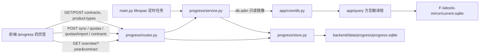

## Product Overview

在 `AI工具合集` 统一工程（FastAPI + Vue3 单入口 8080）中新增独立模块「抽采样进度统计」，访问路径 `/progress`，页面内含「数据看板 / 任务量录入 / 产品类型配置 / 合同管理」四个页签，并在导航首页新增工具卡片。完成量按年从本地 SQLite 镜像聚合，任务量手工录入或 Excel 导入，两者以「合同编号 × 区域 × 产品类型」为准组织，实时算出完成率，支撑"任务进度自动统计"。

## Core Features

- **合同为一级统计维度**：任务量与完成量均按「合同编号 × 区域 × 产品类型」组织。页面顶部提供合同选择器（全部合同汇总 / 单个合同），看板与录入页共用；各合同的任务量分别下达、分别算完成率；汇总视图额外给出按合同拆解的对比小节。
- **合同清单双来源**：同步时自动从镜像发现当年出现的合同编号（含参考名称），配置页可补充名称、备注、启停，未在镜像中出现的合同也能预先录入任务量；人工修改过的名称与状态不被自动发现覆盖。
- **产品类型配置（动态表头来源）**：支持新增、编辑、停用、排序，字段含 名称、别名、所属品类、排序、状态；所有表格列按配置动态生成，停用后不再出现在表头但不破坏历史数据；被任务量引用的产品类型只允许停用，不允许物理删除。
- **完成量抓取**：按年聚合现有 SQLite 镜像（`F:/aitools-mirror/current.sqlite`，随每天 19:00 镜像同步更新）；区域取受检单位所在地解析出的区县，产品类型取样品名称（名称/别名归一匹配），完成量 = 去重样品数；每次抓取写入同步日志（来源、数据截止时间、明细行数、合同数、未匹配与未归类计数、耗时、状态），支持手动触发与每天定时重算。
- **任务量录入与 Excel**：先选合同，再按区域为行、产品类型为列逐格录入，支持批量填充、粘贴与整行整列赋值；Excel 模板列为「合同编号 | 区域 | 产品类型 | 任务量」，导入先逐行校验回显（成功条数 + 失败行号与原因）再整批写入，失败不覆盖已有数据；支持导出当前录入。
- **统计展示**：总览卡片（总任务量、完成量、总完成率、覆盖区域数与合同数）；区域 × 产品类型动态明细矩阵，含合计行、合计列、完成率色阶、超 100% 与未达标标色；ECharts 图表（区域完成率对比条形图、品类分布环形图）；顶部固定透出数据来源与数据截止时间，并对「未匹配产品类型样品数」「未归类区域样品数」「未指定合同样品数」单独提示，杜绝静默丢数。
- **视觉表现**：沿用现有看板的深色科技渐变 + 玻璃拟态卡片风格，渐变标题、卡片入场微动效、图表与表格状态标色，桌面端宽屏布局，与既有模块视觉一致。

## Tech Stack Selection

- 后端：沿用 `FastAPI` + `pydantic-settings`（conda 环境 `aitools`，端口 8080），不引入新框架、不引入新的数据库驱动。
- 数据：达梦数据经**现有 SQLite 镜像**只读获取（`app/core/db.py::adm` → `app/query/try_mirror`，镜像模式下严格不回退直连源库）；配置、任务量、完成量快照、同步日志用标准库 `sqlite3` 落在 `backend/data/progress/progress.sqlite`。
- 前端：沿用 `Vue 3 + TypeScript + Vite + Tailwind`；图表复用既有 `components/charts/useECharts.ts`、`BarChart.vue`（新增一个 `PieChart.vue` 环形图组件）；Excel 复用已有依赖 `exceljs`。
- 文档：按 S1–S6 契约产出 `AI构建工作流/input/抽采样进度统计.md` 与 `AI构建工作流/output/抽采样进度统计/01~06`（技能位于 `AI构建工作流/.codebuddy/skills`，本工作区不复制技能）。

## Implementation Approach

核心策略：**新增一个模块，复用四套既有范式**（模块分层范式、SQLite 存储范式、镜像取数范式、图表/API 客户端范式），零改动既有五个模块。

1. **取数（完成量）**：一次 SQL 从镜像取当年轻量明细，明细列固定为 `s.ID, s.NAME, d.CONTRACTS_NO, d.TASK_NAME, d.DETECTED_COMPANY_ADDRESS, d.SAMPLING_DATE, d.ACCEPT_TIME`，走 `DT_DETECTION d LEFT JOIN DT_SAMPLE s ON s.DETECTION_NO = d.NO AND s.IS_DELETED = 0`，条件含 `d.IS_DELETED = 0`（照抄 `frontend/src/views/dm/blocks/taskStats.ts` 的联接写法）。Python 侧完成三件事：

- **区域归类**：复用 `app/modules/board/service.py` 的 `_parse_region(county, address)`（该模块已有苏州 9 区县固定顺序常量 `REGIONS`，口径与看板同源，便于对拍），入库侧只需传地址；未归类 → 计入「未归类」并在页面提示。
- **产品类型匹配**：名称/别名做全角半角与空白归一后匹配配置；未匹配 → 计入「未匹配样品数」。
- **合同归类**：`d.CONTRACTS_NO` 去空白得合同键（原样保存原文 + 归一化匹配键），为空 → 计入「未指定合同」。
- **聚合**：按 `(合同, 区域, 产品类型)` 汇总 `COUNT(DISTINCT s.ID)`，写入 `done_snapshot`。由于一个样品只归属一个检测编号，合同对样品唯一，"全部合同汇总 = 各合同相加"不会重复计数；仍按 `s.ID` 全局去重并记录「跨合同重复样品数」，出现异常时在同步日志与页面提示。

2. **年份归属**：以 `d.SAMPLING_DATE` 为归属年份，为空回退 `d.ACCEPT_TIME`；SQL 用「日期区间 + `IS NULL` 补集」两段写法，避免 `EXTRACT`/`YEAR()` 包裹列导致索引失效（翻译层虽支持 `EXTRACT(YEAR FROM col)=N` 改写为区间，但显式区间最稳）。
3. **合同自动发现**：同步时另跑一条轻量查询 `SELECT d.CONTRACTS_NO, MAX(d.TASK_NAME) ... WHERE 年份区间 AND d.IS_DELETED = 0 AND d.CONTRACTS_NO IS NOT NULL GROUP BY d.CONTRACTS_NO`（`MAX`/`GROUP BY` 可翻译，禁用 `LISTAGG`/`DECODE`），结果用于补全合同清单与参考名称；已存在记录只补空名称、不动人工填写的名称与启停状态。
4. **时序（手动/定时同步）**：`POST /api/progress/sync` 手动重算；`main.py` 的 `lifespan` 内按镜像定时任务同构写法注册日循环（`PROGRESS_SYNC_AT`，默认 `19:40`，晚于镜像 19:00；留空关闭）。每次同步写 `sync_log` 并记 `data_deadline`（取 `app/mirror/store.py::data_deadline()`）。
5. **读取路径极短**：页面首屏只打一个聚合接口 `GET /api/progress/overview?year=&contract=`（一次返回 summary + 矩阵 + 图表数据 + 按合同拆解 + meta + 合同列表），数据全部来自本地 `progress.sqlite`（毫秒级），避免多次往返与 N+1 组装。
6. **写路径受控**：所有写入走 `UNIQUE` 约束 + 单事务 + 整批校验；产品类型被任务量引用时不物理删除而自动降级为停用；合同删除仅允许 `source=manual` 且无任务量引用。
7. **Excel 导入**：沿用「前端 `exceljs` 解析 → 后端整批校验写入」范式（与 `personnel` 能力表上传一致），后端返回 `{saved, failed:[{row, reason}]}`，同事务写入，失败不落库；模板含合同列，若文件无合同列则回退为"当前所选合同"。

**性能与可靠性**：单年镜像聚合在万级样品量下为百毫秒级（一次扫描 + 内存汇总，索引已覆盖 `DT_DETECTION.CONTRACTS_NO`/`ACCEPT_TIME`）；结果落表后看板恒为毫秒级。同步失败不影响页面（保留上次快照，错误写入同步日志并在页面标出）；镜像缺失或 SQL 不可翻译时接口明确报错（`DbError` → HTTP 502 + `detail`），绝不静默降级。

**避免技术债**：不新增镜像表（`DT_DETECTION`/`DT_SAMPLE` 已在 `app/mirror/sync.py::DM_TABLES`）；区域清单复用 `board/service.REGIONS`；图表复用现有 ECharts 封装；错误处理、日志、配置项写法全部照抄既有模块。

## Implementation Notes

- **SQL 方言约束**（`app/query/__init__.py`）：可用 `NVL`→`IFNULL`、受限 `TO_CHAR`、日期区间、`MAX`/`GROUP BY`；**禁用** `CONNECT BY` / `DECODE()` / `ROWNUM` / `LISTAGG` / `MERGE INTO` / `OVER(` / `SELECT TOP n`，且 SQL 中不得出现 `ALL_TABLES|ALL_TAB_COLUMNS|INFORMATION_SCHEMA|sys.|DBCC`（会被判定为元数据查询而拒绝）。
- **不新增达梦连接**：用户已确认走镜像；模块内不得调用 `db.dm_execute` 直连路径（镜像模式下会被架构约定拒绝），所有取数统一走 `db.adm`。
- **索引（可选）**：若实测单年聚合偏慢，可在 `app/mirror/schema.py::INDEX_SPECS` 为 `DT_DETECTION` 追加 `("SAMPLING_DATE",)`（仅下次镜像同步生效，不影响正确性）。
- **数据新鲜度必须可见**：完成量快照的 `synced_at` 与镜像 `data_deadline` 都要在页面顶部与同步结果中透出，禁止让使用者误以为实时。
- **配置项**：`backend/.env` 新增 `PROGRESS_DIR`（留空 → `backend/data/progress`）与 `PROGRESS_SYNC_AT`，默认值写在 `app/core/config.py`，与 `cma_ledger_dir` / `personnel_ability_dir` 写法一致。
- **前端请求封装**：`frontend/src/api/client.ts` 现有 `get` / `post` / `del` 三个封装（无 `put`）；新增接口优先用 `POST` + 动作路径（与 `/api/personnel/ability-table` 风格一致），若确需 `PUT` 则按同一写法补一个 `put` 封装。
- **前端改动生效**：改前端后必须 `cd frontend && npm run build`（`frontend/dist` 由后端同源托管）；`一键启动.bat` 亦会自动构建。
- **影响面控制**：只新增路由、导航卡片与 `/api/app-info` 的 `modules` 项，不改动 `/dm` `/sqlserver` `/board` `/personnel` `/cma` 的逻辑与样式。
- **日志**：模块内使用 `logging.getLogger("app.progress.*")`，只记条数/耗时/错误摘要，不打印样品明细，不记任何口令。
- **中文路径**：写 `AI构建工作流` 目录（工作区之外）时，脚本内部直接写路径，不用命令行传中文参数。

## Architecture Design



- **分层**：`routes.py`（HTTP 契约、参数校验、错误映射）→ `service.py`（镜像聚合、区域/产品类型/合同归类、矩阵与图表组装、合同自动发现）→ `store.py`（SQLite 结构、事务、唯一约束）。
- **与既有架构的关系**：对齐 `board`（service 聚合与区县口径）+ `personnel`（store 落 SQLite 与整批写入）两套现有范式，不引入新架构模式。
- **关键契约**：`store.py` 是唯一写 SQLite 的地方；`service.py` 是唯一读镜像的地方；`routes.py` 不直接碰数据源（便于 S3 用临时目录 + 假数据做单测）。

## Directory Structure

```
AI工具合集/
├── backend/
│   ├── .env                                          # [MODIFY] 新增 PROGRESS_DIR / PROGRESS_SYNC_AT
│   ├── app/
│   │   ├── main.py                                   # [MODIFY] import/include progress_router；/api/app-info.modules 加 progress；lifespan 内注册完成量定时同步（PROGRESS_SYNC_AT，留空关闭）
│   │   ├── core/config.py                            # [MODIFY] 新增 progress_dir（留空→backend/data/progress）、progress_sync_at（默认 "19:40"）
│   │   ├── mirror/schema.py                          # [MODIFY-可选] INDEX_SPECS 为 DT_DETECTION 追加 ("SAMPLING_DATE",)，仅实测偏慢时启用
│   │   └── modules/progress/
│   │       ├── __init__.py                           # [NEW] 包声明（照 board/personnel 范式）
│   │       ├── store.py                              # [NEW] SQLite 存储层：标准库 sqlite3，目录由 config 决定，照抄 personnel/ability_store.py 的 _SCHEMA + _connect + with conn 事务写法；建表 contract / product_type / task_quota / done_snapshot / sync_log；提供合同 CRUD（含自动发现 upsert 且不覆盖人工名称与启停、manual 合同被引用不可删）、产品类型 CRUD（软停用、被引用不可物理删）、任务量按 (year, contract_no, region, product_type_id) 批量 upsert、完成量整年替换（DELETE + 批量 INSERT 同事务，异常回滚保留旧快照）、同步日志读写
│   │       ├── service.py                            # [NEW] 业务层：镜像聚合 SQL（含 CONTRACTS_NO / TASK_NAME，年份区间走 SAMPLING_DATE 回退 ACCEPT_TIME）；区域归类复用 board.service._parse_region 与 REGIONS；产品类型名称/别名归一匹配；合同键归一与自动发现查询；矩阵、按合同拆解、图表数据与总览指标组装（完成率 = 完成量/任务量，任务量为 0 显示「—」且不参与分母；汇总视图按 s.ID 全局去重并记录跨合同重复数）
│   │       └── routes.py                             # [NEW] 接口：GET /api/progress/overview?year=&contract=；POST /api/progress/sync；GET /api/progress/sync-log；GET /api/progress/contracts?year= 与 POST /api/progress/contracts（新增或更新、启停、删除）；GET/POST /api/progress/product-types；GET /api/progress/quotas?year=&contract= 与 POST /api/progress/quotas；POST /api/progress/quotas/import（批量校验 + 事务写入，返回 saved/failed 明细）。错误统一映射 HTTP 502 + {detail}
│   └── tests/
│       ├── test_progress_service.py                  # [NEW] 单测：区域归类（含未归类）、产品类型别名匹配、合同归类与未指定合同、跨合同重复样品去重、矩阵与完成率组装（任务量为 0 的分母处理）、年份区间 SQL 拼接与禁用方言自检
│       └── test_progress_store.py                    # [NEW] 单测：临时目录建表幂等、任务量 upsert 唯一性、完成量整年替换失败回滚保留旧数据、产品类型与合同被引用不可删、合同自动发现不覆盖人工名称、同步日志写入
├── frontend/
│   ├── src/
│   │   ├── api/client.ts                             # [MODIFY] 新增 progressApi（overview/sync/syncLog/contracts/productTypes/quotas/import）与相关类型定义，沿用现有 get/post/del 封装与错误文案
│   │   ├── router/index.ts                           # [MODIFY] 新增 { path: '/progress', name: 'progress', component: ProgressView }
│   │   ├── views/NavView.vue                         # [MODIFY] TOOLS 增加「抽采样进度统计」卡片（path /progress）+ 配色类 .c-progress
│   │   ├── views/ProgressView.vue                    # [NEW] 模块外壳：渐变标题、年份选择、合同选择器（全部合同汇总/单合同，写入 URL query 供刷新保留）、数据来源与截止时间状态胶囊、同步完成量按钮、四页签切换
│   │   ├── views/progress/DashboardPanel.vue         # [NEW] 总览卡片（总任务量/完成量/总完成率/覆盖区域数与合同数）+ 区域完成率条形图 + 品类分布环形图 + 动态矩阵（首列与表头 sticky、合计行列、完成率色阶、超 100% 与未达标标色）+ 按合同拆解对比小节 + 未匹配/未归类/未指定合同提示 + 导出与同步按钮
│   │   ├── views/progress/QuotaPanel.vue             # [NEW] 任务量批量录入：先选合同（可连同合同列表下拉切换），区域为行 × 产品类型为列的可编辑表格（数字校验、批量填充、粘贴、行/列一键赋值、脏数据角标）、Excel 模板下载与导入（预览 + 逐行校验回显）、保存/重新加载/导出
│   │   ├── views/progress/ProductTypePanel.vue       # [NEW] 产品类型配置：列表（名称/别名/所属品类/排序/状态/操作）+ 新增编辑弹层 + 上下移排序 + 启停 + 删除（被引用时提示改为停用并给出受影响记录数）
│   │   ├── views/progress/ContractPanel.vue          # [NEW] 合同管理：列表（合同编号/名称/备注/来源 自动发现或手工/启停/任务量条数/操作）+ 新增或编辑弹层（手工可预先录入）+ 启停 + 删除（有任务量引用时禁止）+ 按年份筛选与搜索
│   │   ├── views/progress/excel.ts                   # [NEW] Excel 导入解析与导出（exceljs）：模板列「合同编号 | 区域 | 产品类型 | 任务量」，解析为行数组交后端校验；无合同列时回退当前所选合同；看板与录入视图导出
│   │   └── components/charts/PieChart.vue            # [NEW] 环形/饼图组件：复用 useECharts 封装，与既有 BarChart 同风格、同配色数组
│   └── dist/                                         # 由 npm run build 重新生成（后端同源托管）
├── 使用说明.txt                                       # [MODIFY] 补充 /progress 入口、合同维度与口径说明
└── AI构建工作流/                                       # 工作区之外，按 S1–S6 契约产出文档
    ├── input/抽采样进度统计.md                          # [NEW] 需求原文（用户原话 + 两轮澄清结论）
    └── output/抽采样进度统计/
        ├── 01_问题定义.md ~ 06_解决报告.md              # [NEW] S1~S6 产物（含合同维度口径、验收标准 AC、工作列表 W、测试与验证结论）
        └── _process/                                  # [NEW] 过程文件（口径探测输出、对拍数据、截图）
```

## Key Code Structures

`progress.sqlite` 表结构（多模块依赖，需精确）：合同与产品类型既是动态统计维度、又是表头/分组来源；任务量与完成量一律以 `(year, contract_no, region, product_type_id)` 为键，改配置不改历史数据。

```sql
-- 合同（自动发现 + 人工补充）
CREATE TABLE IF NOT EXISTS contract (
  contract_no TEXT    PRIMARY KEY,            -- 归一化后的合同编号（原样去掉首尾空白）
  name        TEXT    NOT NULL DEFAULT '',    -- 合同名称，人工优先，自动发现只补空
  note        TEXT    NOT NULL DEFAULT '',    -- 备注（人工）
  source      TEXT    NOT NULL DEFAULT 'auto',-- auto 自动发现 / manual 手工录入
  enabled     INTEGER NOT NULL DEFAULT 1,     -- 1 启用 / 0 停用
  name_locked INTEGER NOT NULL DEFAULT 0,     -- 1 表示名称被人工改过，自动发现不得覆盖
  updated_at  TEXT    NOT NULL DEFAULT ''
);

-- 产品类型配置（动态表头来源）
CREATE TABLE IF NOT EXISTS product_type (
  id         INTEGER PRIMARY KEY AUTOINCREMENT,
  name       TEXT    NOT NULL,                -- 表头列名（如 豇豆）
  alias      TEXT    NOT NULL DEFAULT '',     -- 别名，用 | 分隔，用于匹配样品名称
  category   TEXT    NOT NULL DEFAULT '',     -- 所属品类（蔬菜/水果/畜产品/水产品/其他），供品类分布图
  sort_no    INTEGER NOT NULL DEFAULT 0,      -- 列顺序
  enabled    INTEGER NOT NULL DEFAULT 1,      -- 1 启用 / 0 停用（停用列不出现在表头）
  updated_at TEXT    NOT NULL DEFAULT ''
);
CREATE UNIQUE INDEX IF NOT EXISTS ux_product_type_name ON product_type(name);

-- 任务量（手工录入 / Excel 导入；按年 + 合同）
CREATE TABLE IF NOT EXISTS task_quota (
  year            INTEGER NOT NULL,
  contract_no     TEXT    NOT NULL,           -- 对应 contract.contract_no；未指定合同用 '' 占位
  region          TEXT    NOT NULL,           -- 区县，与 board/service.REGIONS 同源
  product_type_id INTEGER NOT NULL,
  quota           INTEGER NOT NULL DEFAULT 0,
  updated_at      TEXT    NOT NULL DEFAULT '',
  PRIMARY KEY (year, contract_no, region, product_type_id)
);

-- 完成量快照（按年 + 合同；一次同步整年替换，失败回滚保留旧快照）
CREATE TABLE IF NOT EXISTS done_snapshot (
  year            INTEGER NOT NULL,
  contract_no     TEXT    NOT NULL,
  region          TEXT    NOT NULL,
  product_type_id INTEGER NOT NULL,
  done            INTEGER NOT NULL DEFAULT 0,
  synced_at       TEXT    NOT NULL DEFAULT '',
  PRIMARY KEY (year, contract_no, region, product_type_id)
);

-- 完成量同步日志（每次抓取一行，只增不删）
CREATE TABLE IF NOT EXISTS sync_log (
  id           INTEGER PRIMARY KEY AUTOINCREMENT,
  year         INTEGER NOT NULL,
  started_at   TEXT NOT NULL DEFAULT '',
  finished_at  TEXT NOT NULL DEFAULT '',
  source       TEXT NOT NULL DEFAULT '',      -- 固定 'mirror'
  data_deadline TEXT NOT NULL DEFAULT '',     -- 镜像快照数据截止时间
  rows         INTEGER NOT NULL DEFAULT 0,    -- 抓取明细行数
  done_total   INTEGER NOT NULL DEFAULT 0,    -- 去重样品总数
  contract_count INTEGER NOT NULL DEFAULT 0,  -- 本次发现/涉及的合同数
  dup_across_contracts INTEGER NOT NULL DEFAULT 0, -- 跨合同重复样品数（异常检测，正常为 0）
  unmatched    INTEGER NOT NULL DEFAULT 0,    -- 未匹配产品类型样品数
  unclassified INTEGER NOT NULL DEFAULT 0,    -- 未归类区域样品数
  no_contract  INTEGER NOT NULL DEFAULT 0,    -- 未指定合同样品数
  elapsed_ms   INTEGER NOT NULL DEFAULT 0,
  status       TEXT NOT NULL DEFAULT '',      -- ok / failed
  error        TEXT NOT NULL DEFAULT ''
);
```

## Design Style

沿用并强化现有工程（`frontend/src/styles`、`tailwind.config.js`、`BoardView.vue`）的**深色科技渐变 + 玻璃拟态**语言：靛蓝到紫到蓝的固定径向渐变背景（紫/青/粉三处柔光），半透明玻璃卡片、渐变文字标题、青蓝渐变主按钮，卡片轻微上浮与阴影，入场使用既有 `animate-fade-up` 类动效，加载使用既有 `.loader`。整页为桌面端宽屏布局（内容区最大 1440px），高信息密度但不拥挤，与既有 5 个模块视觉一致。

## Layout And Navigation

顶部为「渐变标题 + 年份选择 + 合同选择器 + 数据来源与截止时间状态胶囊 + 同步完成量主按钮」，其下为模块内页签（数据看板 / 任务量录入 / 产品类型配置 / 合同管理），页脚为口径说明条（说明合同、区域、产品类型与年份归属口径）。路由 `/progress`，导航首页新增同风格卡片。

## Page Planning

### 1. 数据看板页（默认页签）

- 顶部操作区：年份下拉、合同选择器（全部合同汇总/单合同）、数据来源与镜像数据截止时间胶囊、同步完成量主按钮（同步中禁用并显示进度文案）、导出 Excel 次级按钮。
- 总览卡片区：四张玻璃卡（总任务量 / 完成量 / 总完成率 / 覆盖区域数与合同数），完成率用大号渐变数字加进度细条，低于阈值时条变暖色，悬停上浮。
- 图表区：左侧区域完成率对比横向条形图（按完成率降序、超 100% 变色），右侧品类分布环形图（按所属品类汇总任务量与完成量，中心显示合计）。
- 动态明细矩阵：行等于区域，列等于启用中的产品类型，单元格显示完成量与任务量及完成率并按色阶着色；首列与表头吸顶，横向滚动，底部合计行与右侧合计列；数据为空时给出引导去录入任务量。
- 按合同拆解小节：汇总视图下逐合同展示总任务量、完成量、完成率与状态标色，可一键切到单合同视图。
- 提示条：未匹配产品类型样品数、未归类区域样品数、未指定合同样品数、上次同步时间与失败原因（有则高亮，无则不渲染）。

### 2. 任务量录入页

- 顶部说明区：年份与合同选择、当前行列口径说明、下载模板与导入 Excel 入口。
- 批量录入表格：区域为行、启用产品类型为列的可编辑输入格，数字校验，支持行或列一键赋值、粘贴与清空，脏数据以角标提示未保存数量。
- Excel 导入区：拖拽或选择文件（合同编号 | 区域 | 产品类型 | 任务量），解析预览与逐行校验结果（成功条数加失败行号与原因），确认后写入。
- 保存与反馈：保存主按钮（成功显示结果条与影响行数）、重新加载、导出当前录入。
- 同步状态条：展示当前年份完成量快照时间与合同数，便于录入时对表。

### 3. 产品类型配置页

- 顶部操作区：新增产品类型主按钮、搜索框、显示或隐藏已停用开关。
- 配置列表：产品类型、别名、所属品类、排序、状态、操作；行内展示当前年份该列的完成量条数，便于判断配置是否生效。
- 新增或编辑弹层：名称、别名（竖线分隔并提示匹配规则）、所属品类（下拉加自由填写）、排序号、启用开关，名称唯一性即时校验。
- 排序与状态：上移下移调整列顺序，启用停用一键切换（停用列立即从看板表头消失）。
- 删除保护：已被任务量引用的产品类型禁止删除，提示改写为停用并给出受影响记录数。

### 4. 合同管理页

- 顶部操作区：新增合同主按钮、年份筛选、搜索框、来源筛选（自动发现或手工）、显示或隐藏已停用开关。
- 合同列表：合同编号、名称、备注、来源徽标、启用状态、当前年份任务量条数、操作；自动发现行标注来源并高亮无名称待补充项。
- 新增或编辑弹层：合同编号（唯一性即时校验，手工录入允许预先录入镜像中尚未出现的编号）、名称、备注、启用开关。
- 状态与删除：一键启停（停用后不出现在看板与录入页的合同选择器默认列表，可按需显示）；有任务量引用的合同禁止删除并提示影响记录数。

## Agent Extensions

### SubAgent

- **code-explorer**
- Purpose: 在 S2 落地前，核实镜像内 `DT_DETECTION` 与 `DT_SAMPLE` 的实际列名（尤其 `CONTRACTS_NO`、`TASK_NAME`、`DETECTED_COMPANY_ADDRESS`、`SAMPLING_DATE`、`ACCEPT_TIME`、`IS_DELETED`）、单年数据量与合同分布，确认新增 SQL 经 `app/query` 翻译层可执行（无不可翻译构造），并核实 `board/service.py` 的 `REGIONS`、`_parse_region(county, address)` 签名与 `personnel/ability_store.py` 的存储范式、`components/charts` 与 `api/client.ts` 的可用能力。
- Expected outcome: 一份经代码与数据双重验证的字段与口径结论（含合同样例值与单年样品量），直接写入 `02_解决方案.md`，避免猜字段造成的返工。

### Skill

- **ui-ux-pro-max**
- Purpose: 为「数据看板 / 任务量录入 / 产品类型配置 / 合同管理」四个页签落地具体视觉与交互规范：玻璃拟态卡片层级、合同选择器与状态胶囊的视觉权重、动态矩阵的吸顶与完成率色阶、录入表格的批量填充与粘贴交互、环形图样式与配色。
- Expected outcome: 四个页签的样式与交互实现细则（含 Tailwind 类与各状态样式），实现后完成一次视觉一致性与可用性自检并留下结论。